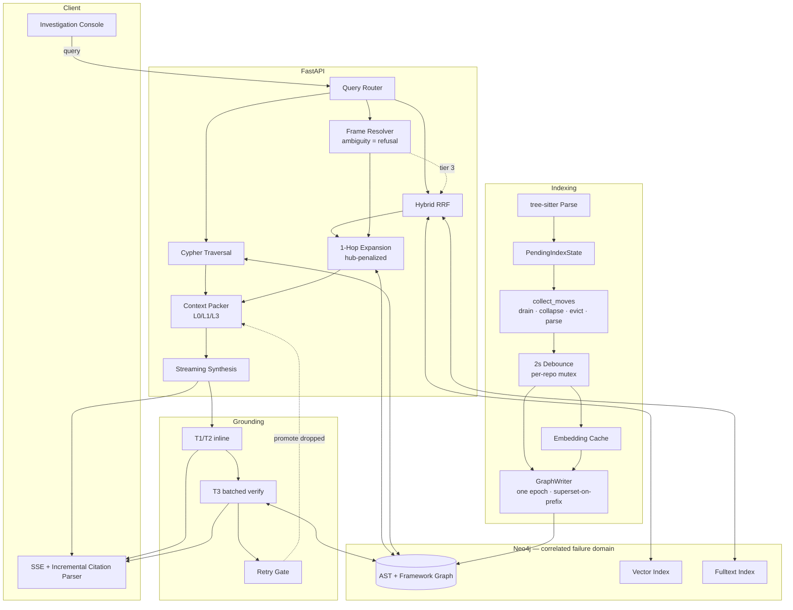

# Software Engineering Investigation Engine (SEI)
## Architecture Specification v10.0

**Domain:** Repository-level GraphRAG question-answering and debugging over Python/Django and TypeScript/React/Next.js codebases.

**Status:** Specified, not executed. No statement in this document has been run against a live Neo4j instance or a real repository. §0.2 lists what that leaves open. Constants marked † are unvalidated starting points, not measured values.

---

## 0. Status

### 0.1 Changes from v9.2

Nine technical defects, found by re-verifying the data model and control flow rather than the syntax.

| # | Defect | Fix |
|---|---|---|
| T1 | **UIDs collide within a file.** TypeScript overloads and conditionally-defined Python functions share `qualified_name` *and* arity, so `MERGE` collapses them into one node. | Source-order ordinal in the UID (§3.2) |
| T2 | **`arity` undefined.** UID stability depends on it being computed identically on every parse; optional params, rest params, and defaults had no rule. | Per-language rule (§3.2) |
| T3 | **`full_reconcile()` called three times, specified nowhere.** Load-bearing for the bulk path, move recovery, and one metric. | Specified (§4.5) |
| T4 | **Undetected-move rate needed stored previous-reconcile state**, which nothing provided. | Falls out of the reconcile diff (§4.5); no extra state |
| T5 | **Nothing writes `code_vec`.** `embed_batch` returns vectors; step 3a writes `sym.props`; vectors were never merged in. Symbols would index with null embeddings. | Merge before write (§4.2, §11.2) |
| T6 | `ParsedFile.symbols` and `.chunks` used interchangeably. | One type, one field (§4.2) |
| T7 | `symbol_lines` and `symbol_origin` omit `repo_id`, contradicting §9.1. | Added (§11.3) |
| T8 | Anonymous default exports have no `qualified_name`. | Naming rule (§3.2) |
| T9 | `vec_epoch` in the property list, written by nothing. | Marked Phase 1, unused at MVP (§3.3) |

Editorial: revision history, principle-numbering annotations, and process commentary removed. Provisional constants marked †.

### 0.2 Unverified

Answered by executing one statement each against a live instance — the Week 1 scaffold (§10):

- `$edge_weights[rel]` — dynamic map key on a parameter
- `COUNT { … }` and `NOT EXISTS { MATCH … }` availability on the deployed Neo4j 5.x minor
- Vector-index DDL: whether the property takes parentheses on that version
- tree-sitter TSX grammar: whether it emits the node types §3.4's chunker assumes
- Every threshold in §8.2 and every constant marked †

---

## 1. Design Principles

1. **Deterministic before probabilistic.** If a fact is available from a graph lookup, a hash comparison, or an editor event, do not infer it.
2. **The graph must earn its keep.** A graph used only for validation is overhead. It must contribute retrieval context.
3. **Degrade, don't fail.** Every dependency has a defined fallback (§9.3).
4. **Measure or don't claim.** No target is set for a capability whose usage has not been observed.
5. **A defect authorizes a defect-sized fix.** Finding a bug is not evidence its general solution is needed.
6. **A metric named twice is defined once.** A quantity appearing in both §8 and §10 is the same quantity, same name, same measurement.
7. **Cost claims carry the same burden as behavior claims.** "A connection-string change," "no extra instrumentation," "a one-file swap" each assert something checkable about work not yet done.
8. **State the property you have, not the strongest-sounding one.** The batch is crash-safe by ordering, not atomic (§4.3). A claim nobody can act on is worse than none, because downstream design gets built against it.

---

## 2. Seams

Seven interfaces, one implementation each. Total ~200 lines.

| Seam | Interface | MVP | Swap cost |
|---|---|---|---|
| **S1** | `RetrievalBackend.search(vec, filters, k)` | Neo4j vector index | Cheap to call across; changes the recovery model (§12.1) |
| **S2** | `LLMProvider.stream()` · `.embed()` · `.tokenize()` | Hosted API, named in eval config | LLM side: one file. Embedding side: full re-index (§12.11) |
| **S3** | `LanguageAdapter.parse()` · `.resolve_frame()` | `python`, `typescript`, `tsx` | One file per language |
| **S4** | `JobRunner.submit()` | `ThreadPoolExecutor` | One file |
| **S5** | `EmbeddingCache.get_many()` · `.put_many()` | SQLite | One file |
| **S6** | `GraphWriter.apply()` · `.remap_uids()` | Direct Bolt | Call sites uniform; migration is weeks (§9.1) |
| **S7** | `EvalHarness.run()` | Scaffold Week 1; 45 questions Week 6 | — |

**The seams make call sites uniform. Three of seven are not cheap to cross** — see the swap-cost column and §12.11. Editor integration is not a seam: it is an inbound event boundary with one implementation per editor.

---

## 3. Data Model

### 3.1 Labels

```
(:Symbol:Function), (:Symbol:Class), (:Symbol:Module), (:File)
```

A common supertype keeps one uniqueness constraint, one vector index, one full-text index. Peer labels would fragment the vector index.

### 3.2 UID Contract

```python
def symbol_uid(repo_id: str, rel_path: str, qualified_name: str,
               arity: int, ordinal: int = 0) -> str:
    return hashlib.sha1(
        f"{repo_id}\x00{rel_path}\x00{qualified_name}\x00{arity}\x00{ordinal}".encode()
    ).hexdigest()[:20]
```

**Ordinal (T1).** Index among symbols in the same file sharing `(qualified_name, arity)`, assigned in source order, almost always 0. Without it, TypeScript overloads —

```ts
function parse(x: string): Node;      // arity 1
function parse(x: number): Node;      // arity 1
function parse(x: any): Node { … }    // arity 1
```

— produce three identical UIDs, and `MERGE` collapses them into one node whose properties are whichever declaration was written last. The same happens with conditionally-defined Python functions (`if TYPE_CHECKING:` branches, platform guards). Reordering declarations churns ordinals and therefore UIDs; that is acceptable, since reordering overloads is rare and the churn is confined to one file.

**Arity (T2).** UID stability depends on this being computed identically on every parse, so the rule is fixed:

| Language | Counted | Excluded |
|---|---|---|
| Python | positional, keyword-only, params with defaults | `self`, `cls`, `*args`, `**kwargs` |
| TS/JS | declared params including optional (`b?`) | rest (`...r`), `this` param |

Defaults are counted but their *values* are not, so changing `timeout=30` to `timeout=60` does not churn the UID.

**Qualified names (T8).** Derived from the module path plus enclosing scopes: `auth.views.LoginView.post`. For anonymous default exports, `<module>.default`. Arrow functions assigned to a binding take the binding's name. **Truly anonymous functions — IIFEs, inline callbacks — are not symbols** and are not indexed; they appear only inside their enclosing symbol's body.

**Excluded from the UID:** line numbers (they churn on every edit above the symbol; stored as mutable properties) and body content (a symbol whose body changes is the same symbol).

**Why `rel_path` stays.** Two `handler` functions in different modules collide; TS default exports and barrel files make `qualified_name` non-unique; Next.js App Router route files each export a function named `GET` or `POST`, so bare names are duplicated by convention. This same collision governs TRACE Tier 2 (§5.1), where a stack frame supplies a bare name and a compiled path and therefore cannot disambiguate.

### 3.3 Node Properties

```
:Symbol {
  uid, repo_id, rel_path, origin_path,
  qualified_name, name, arity, ordinal, kind,
  signature, docstring, source_code,
  enclosing_signature,           -- full, incl. bases: "class LoginView(APIView)"
  search_text,                   -- §5.3
  body_hash, header_hash,        -- §4.2 cache key components
  used_imports[],                -- resolved per-symbol, not file-level
  code_vec,                      -- written via sym.props; see §4.2 (T5)
  vec_epoch,                     -- Phase 1 only (§12.1); unwritten at MVP
  start_line, end_line, degree,
  epoch, is_client_component, decorators[]
}

:File { repo_id, rel_path, content_hash, epoch }
```

`degree` is precomputed at write time, never inside a traversal.

### 3.4 Chunking

1. **Unit = one symbol** (function or method). `ParsedFile.symbols` is the only collection; each symbol carries its own `chunk_text` (T6).

2. **Context header, symbol-scoped:**
   ```
   # repo/auth/views.py :: class LoginView(APIView) :: def post(self, request) -> Response
   # imports used: rest_framework.Response, .models.User, .serializers.LoginSerializer
   ```
   The `imports used` line is built by walking the symbol's own AST, collecting free identifiers, and resolving them against the file's import table — only what this symbol references. Populating it from the file's import block instead makes the header a function of the whole file, so one added import invalidates every cached embedding in it.

   The class line is `enclosing_signature`, including base classes, and §4.2 hashes it accordingly.

3. **Overflow split** at >1200† tokens, on top-level statement boundaries, header repeated.
4. **Class chunks** = signature + docstring + method *signature* list. Not bodies; those are separate symbols.
5. **File chunks** = import block + top-level symbol list.

### 3.5 Framework Layer

- **Django:** `(UrlRoute)-[:DISPATCHES_TO]->(View)` from `urls.py`; `(Model)-[:HAS_FIELD]->(Field)`; `(View)-[:USES_SERIALIZER]->(Serializer)`.
- **React/Next:** `(Component)-[:INVOKES_HOOK]->(Hook)`; `is_client_component` from `'use client'`; `(Route)-[:RENDERS]->(Component)` from App Router conventions.
- Dynamic metaclass resolution is omitted rather than guessed. String-based framework references (§12.3) are likewise not edges.

---

## 4. Indexing

| Stage | Cost | Trigger |
|---|---|---|
| tree-sitter parse → memory | ~5ms/file, local | Eager on save; at flush for renames |
| Neo4j upsert | 15–50ms/txn, lock-bearing | Debounced, 2s idle, coalesced |
| Embedding | Network | Debounced, same batch |

### 4.1 Debounce Contract

```python
class Indexer:
    def __init__(self):
        self._pending: dict[str, dict[str, ParsedFile]] = defaultdict(dict)
        self._renames: dict[str, list[Move]] = defaultdict(list)
        self._indexed: dict[str, set[str]] = defaultdict(set)
        self._timers:  dict[str, asyncio.TimerHandle] = {}
        self._locks:   dict[str, asyncio.Lock] = defaultdict(asyncio.Lock)

    async def startup(self, repo: str) -> None:
        self._indexed[repo] = await self.reader.known_paths(repo)

    def on_save(self, repo: str, path: str, content: bytes) -> None:
        self._pending[repo][path] = self.adapter.parse(path, content)
        self._reset_debounce(repo, delay=2.0)

    def on_rename(self, repo: str, old: str, new: str) -> None:
        self._renames[repo].append(Move(old, new))
        self._reset_debounce(repo, delay=2.0)

    def collect_moves(self, repo: str) -> list[Move]:
        """Single owner of move bookkeeping: drain, collapse, evict, parse."""
        pending = self._pending[repo]
        moves, self._renames[repo] = self._renames[repo], []          # Signal A

        # Signal B costs a subprocess spawn (~50-200ms on a large repo), so run
        # it only when Signal A found nothing and the batch holds a path the
        # graph has never seen.
        if not moves and any(p not in self._indexed[repo] for p in pending):
            moves += parse_git_renames(git("status", "--porcelain", "-M"))

        moves = _collapse_chains(moves)

        resolved = []
        for mv in moves:
            pending.pop(mv.old_path, None)          # or the upsert recreates old_uid
            if mv.new_path not in pending:          # Signal B never parsed it
                try:
                    pending[mv.new_path] = self.adapter.parse(
                        mv.new_path, read(mv.new_path))
                except OSError:
                    metrics.incr("move.new_path_unreadable")
                    continue                        # degrades to undetected move
            resolved.append(mv)
        return resolved

    async def _flush(self, repo: str) -> None:
        async with self._locks[repo]:               # per-repo, not global
            moves = self.collect_moves(repo)        # mutates _pending; call first
            batch, self._pending[repo] = self._pending[repo], {}
            epoch = time.time_ns()                  # one epoch per batch

            # Moved-from paths stay in scope, or a remap collision leaves an
            # orphan node and un-repointed edges uncollected.
            batch_paths = set(batch) | {m.old_path for m in moves}

            if moves:                               # before the bulk branch
                await self.writer.remap_uids(
                    repo, resolve_moves(repo, moves, batch), epoch)

            if len(batch) > BULK_THRESHOLD:         # 200†
                return await self.full_reconcile(repo, epoch=epoch)

            vectors = await self.embed_batch(repo, batch)
            await self.writer.apply(repo, batch, batch_paths, vectors, epoch)
            self._indexed[repo] |= set(batch)


def _collapse_chains(moves: list[Move]) -> list[Move]:
    """A->B then B->C in one window becomes A->C. Without this, processing B->C
    evicts pending[B], so the A->B remap finds nothing in the batch. Also
    idempotent over duplicate Move records, and removes any dependence on
    Cypher row ordering in §11.2 step 2a."""
    origin: dict[str, str] = {}                     # current_path -> original_path
    for mv in moves:
        origin[mv.new_path] = origin.pop(mv.old_path, mv.old_path)
    return [Move(old, new) for new, old in origin.items() if old != new]
```

`collect_moves` runs before `batch` is drained because it mutates `_pending`. Remaps apply before the bulk branch: after the rewrite, graph and filesystem agree, so reconcile finds less to do.

**Triggers:** save (eager, local); rename (recorded, parsed at flush, since a pure move fires no save); 2s idle debounce; per-repo writer mutex; `post-commit`/`post-checkout`; manual Sync Project; cold start (resumable, queryable while partial).

Read consistency lags the editor by up to ~2s (§12.2).

### 4.2 Embedding Cache

```python
def cache_key(sym: Symbol) -> str:
    body_hash   = sha256(_normalize(sym.source_code).encode()).hexdigest()[:20]
    header_hash = sha256("\x00".join([
        sym.rel_path,
        sym.enclosing_signature or "",   # full, with bases — what the header shows
        sym.signature,
        *sorted(sym.used_imports),       # per-symbol, not the file import block
    ]).encode()).hexdigest()[:12]
    return f"{header_hash}:{body_hash}"

def _normalize(src: str) -> str:
    # Comments retained: they carry retrieval signal. Secret scrubbing (§9.2)
    # runs before this, so scrub-rule changes invalidate correctly.
    return "\n".join(l.rstrip() for l in src.replace("\r\n", "\n").split("\n")).strip()

async def embed_batch(repo: str, batch: dict[str, ParsedFile]) -> dict[str, Vector]:
    syms = [s for f in batch.values() for s in f.symbols]          # T6
    keys = {s.uid: cache_key(s) for s in syms}
    hits = await cache.get_many(list(keys.values()))               # S5

    cold = [s for s in syms if keys[s.uid] not in hits]
    if cold:
        # Header-only miss share (§8.3): compare against the body_hash stored on
        # the existing node, fetched in one batched read. Absent = new symbol =
        # counts as a body change.
        prev = await reader.body_hashes(repo, [s.uid for s in cold])
        metrics.incr("cache.miss.header_only",
                     sum(1 for s in cold if prev.get(s.uid) == s.body_hash))
        metrics.incr("cache.miss.total", len(cold))
        fresh = await provider.embed([s.chunk_text for s in cold])  # S2
        await cache.put_many(list(zip((keys[s.uid] for s in cold), fresh)))
        hits.update(dict(zip((keys[s.uid] for s in cold), fresh)))

    return {s.uid: hits[keys[s.uid]] for s in syms}
```

**T5.** `GraphWriter.apply` merges the returned vectors into each symbol's props before writing, so step 3a's `SET s += sym.props` persists `code_vec`. v9.2 returned vectors that no statement consumed; symbols would have indexed with null embeddings and been invisible to vector search while appearing healthy in the graph.

Warm body-hash reuse and background re-embed are deferred: every header component except `rel_path` and `enclosing_signature` correlates with a body change, so that path fires almost only on file moves and class renames. Trigger: §8.3 header-only miss share.

Steady-state target >90%†, gated in §8.2 — the failure is silent and cannot be noticed, only measured.

### 4.3 Epoch Reconciliation

```
1. epoch = now_ns()                    -- once, for the whole batch
2. Apply UID remaps                    -- before upsert, before the bulk branch
3. Upsert nodes (3a), then edges by type (3b), stamped {origin_path, epoch}
4. Delete edges WHERE origin_path ∈ batch_paths AND epoch < $epoch
5. Detach-delete orphan symbols from batch_paths
6. Refresh degree: touched symbols (6a), then neighbors (6b)
```

**The guarantee.** This sequence is **not atomic**. It spans several statements and, at scale, several transactions. What ordering provides:

> **Superset-on-prefix.** Any prefix leaves the graph a superset of the truth — stale rows, never dangling references — because writes precede deletes.
> **Idempotent replay.** Re-running from step 1 with the same epoch converges. Nothing depends on observing intermediate states.

This survives commit chunking, which atomicity would not. §12.1's split-store analysis depends on stating it this way.

`batch_paths` is `batch.keys() ∪ {move.old_path}`. Step 2 precedes step 3 so `MERGE` lands on corrected UIDs rather than creating duplicates that step 5 would delete, taking their inbound edges along.

### 4.4 Move Detection

Path-derived UIDs mean a move changes every UID in a file. Handled naively, the symbols are deleted and recreated, severing every inbound `CALLS` edge from unchanged files — the system then reports zero callers for code with dozens, which is worse than an error because it looks like an answer.

**Signal A (primary):** the editor's rename event — `vscode.workspace.onDidRenameFiles`, JetBrains `RefactoringEventListener` — posted to `/index/rename` → `Indexer.on_rename`. One integration per editor, ~0.5 engineer-week each.

**Signal B (fallback):** `git status --porcelain -M`, which detects renames against index-vs-HEAD. An unstaged working-tree move appears as `D old` plus `?? new` and is not detected.

| Path | Signal | Result |
|---|---|---|
| VS Code / JetBrains with plugin | A | Exact, live |
| `git mv`, or `mv` + `git add` | B | Exact, next flush |
| Any editor without a plugin | — | Undetected |
| Plain `mv`, unstaged | — | Undetected |
| File manager, build script, `rsync` | — | Undetected |

Undetected moves sever inbound edges until Sync Project, surfaced by the staleness badge and counted by §8.3.

**No similarity heuristic.** Content-overlap detection can mis-fire and merge two unrelated files sharing boilerplate. A missed move is recoverable by one button and visible in the badge; a wrong merge is silent and corrupts the graph.

**The fix is in-place UID rewrite.** Because UID is the identity every edge references, rewriting it preserves inbound edges without touching them.

```python
def resolve_moves(repo: str, moves: list[Move],
                  batch: dict[str, ParsedFile]) -> list[Remap]:
    """Old and new UIDs are both computable from the new file's parsed symbols,
    since qualified_name, arity, and ordinal survive a move."""
    out = []
    for mv in moves:
        parsed = batch.get(mv.new_path)
        if parsed is None:
            metrics.incr("move.unresolvable")       # should be identically 0
            continue
        for s in parsed.symbols:
            out.append(Remap(
                old_uid=symbol_uid(repo, mv.old_path, s.qualified_name,
                                   s.arity, s.ordinal),
                new_uid=symbol_uid(repo, mv.new_path, s.qualified_name,
                                   s.arity, s.ordinal),
                old_path=mv.old_path, new_path=mv.new_path))
    return out
```

On collision — a file moved onto another — the remap is skipped and the symbol is handled by the normal upsert path as new. The retired node is reachable by steps 4–5 only because `batch_paths` includes `old_path`.

Import-path repair for undetected moves is deferred; trigger in §10.2.

### 4.5 Full Reconcile

Referenced by the bulk-batch branch, `post-checkout`, Sync Project, and cold start.

```python
async def full_reconcile(self, repo: str, epoch: int | None = None) -> None:
    epoch = epoch or time.time_ns()
    tree  = walk_working_tree(repo)                  # respects .gitignore
    known = await self.reader.file_hashes(repo)      # rel_path -> content_hash

    added    = [p for p in tree if p not in known]
    modified = [p for p in tree if p in known and tree[p] != known[p]]
    deleted  = [p for p in known if p not in tree]

    # Undetected-move rate (§8.3) falls out of this diff: a symbol that left a
    # deleted path and appeared at an added path with the same body_hash and
    # qualified_name was a move no live signal caught. No stored previous-
    # reconcile state is required.
    metrics.incr("move.undetected", count_body_hash_matches(added, deleted))

    for chunk in chunked(added + modified, BULK_THRESHOLD):
        parsed  = {p: self.adapter.parse(p, read(p)) for p in chunk}
        vectors = await self.embed_batch(repo, parsed)
        await self.writer.apply(repo, parsed, set(chunk), vectors, epoch)

    if deleted:                                      # steps 4-5 remove them
        await self.writer.apply(repo, {}, set(deleted), {}, epoch)

    await self.writer.refresh_all_degrees(repo)      # one pass beats N local ones
    self._indexed[repo] = set(tree)
```

Resumable: each chunk is independently replayable under the same epoch (§4.3), so an interrupted reconcile resumes by re-running. Partial state is queryable throughout, with the staleness badge showing progress.

---

## 5. Retrieval

### 5.1 Query Router

| Class | Example | Path |
|---|---|---|
| **STRUCTURAL** | "what calls `charge_card`" | Entity resolve → Cypher traversal *is* the answer |
| **SEMANTIC** | "how does auth work" | Hybrid RRF → 1-hop expand → synthesize |
| **TRACE** | pasted stack trace | Frame resolution → UID lookup → expand |

Regex heuristics first, LLM fallback for ambiguity.

**Frame resolution.**

- **Tier 0 — Direct (Python).** Normalize to repo-relative, then `(repo_id, rel_path, start_line ≤ N ≤ end_line)`. Deterministic.
- **Tier 2 — Name match (TS/JS/TSX).**

  ```python
  cands = graph.symbols_named(repo, frame.fn_name)      # index: (repo_id, name)
  if len(cands) == 1:
      return ResolvedFrame(uid=cands[0].uid, tier="name", confidence=0.6)
  metrics.incr("trace.tier2.ambiguous" if cands else "trace.tier2.miss")
  return None                                           # -> Tier 3
  ```

  **Ambiguity is refusal.** Next.js App Router route files each export a function named `GET`, `POST`, `PUT`, or `DELETE`, so a repo carries dozens of identical bare names, and the frame's own path is a compiled chunk — the same reason sourcemaps are needed makes the path useless for disambiguation. §3.2 identifies this collision as why `rel_path` belongs in the UID; the same fact governs resolution here. A `~ name match` badge on a 1-in-40 guess is worse than no answer, because §12.4 shows the trust model depends on that badge meaning something.

- **Tier 3 — SEMANTIC fallback.** Re-route on the error message plus any resolvable neighbouring frame.

Sourcemap consumption is deferred; trigger in §10.2, with `trace.tier2.ambiguous` counting as unresolved. Confidence is surfaced per frame: `✓ direct`, `~ name match`, `? semantic`.

### 5.2 Graph-Augmented Hybrid Retrieval

```
1. Hybrid RRF: vector(code_vec) ∥ fulltext(search_text) -> top-30†
2. Rerank -> top-8† seeds                      [Phase 1; MVP uses raw RRF]
3. 1-hop expand each seed:
     outbound CALLS · inbound CALLS · DEFINES parent · DISPATCHES_TO
   Skip neighbors where degree > 100†
4. Score: seed_support x edge_weight / log(2 + degree)
5. Pack (§5.4)
```

Step 3 is the justification for running a graph database. Without it, Neo4j is an expensive Postgres.

Edge weights†: `CALLS 1.0`, `DEFINES 0.8`, `DISPATCHES_TO 0.9`, `IMPORTS 0.4`.

### 5.3 BM25 on Code

Lucene's `StandardAnalyzer` is tokenizer + lowercase + stop-word filter. It does **not** stem. Two failures matter:

1. **No identifier splitting.** `StandardTokenizer` follows UAX#29, under which underscore joins rather than separates. `get_user_by_id` and `getUserById` each remain one opaque token, so "get user by id" scores zero against both.
2. **Stop-word removal**, which deletes `in`, `for`, `if`, `not` — meaningful in code. Addressed by `standard-no-stop-words` (§11.3); splitting is not, which is why tokenization happens in Python.

```python
_CAMEL = re.compile(r'(?<=[a-z0-9])(?=[A-Z])|(?<=[A-Z])(?=[A-Z][a-z])')
_DIGIT = re.compile(r'(?<=[A-Za-z])(?=\d)|(?<=\d)(?=[A-Za-z])')
_SEPS  = re.compile(r'[_\-./:]+')

def split_identifier(name: str) -> list[str]:
    parts: list[str] = []
    for seg in _SEPS.split(name):              # get_user_by_id -> [get,user,by,id]
        if not seg:
            continue
        for cam in _CAMEL.split(seg):          # getUserById    -> [get,User,ById]
            parts.extend(p for p in _DIGIT.split(cam) if p)
    return parts

def build_search_text(sym: Symbol) -> str:
    lowered = [t.lower() for t in split_identifier(sym.name)]
    return " ".join(filter(None, [
        sym.name, sym.qualified_name, sym.name.lower(),   # exact forms preserved
        *lowered, "".join(lowered), "_".join(lowered),    # split + rejoined
        sym.docstring or "",
    ]))
```

| Input | `search_text` contains |
|---|---|
| `get_user_by_id` | `get_user_by_id` · `get user by id` · `getuserbyid` |
| `getUserById` | `getUserById` · `get user by id` · `getuserbyid` · `get_user_by_id` |
| `HTTPResponseHandler` | `HTTPResponseHandler` · `http response handler` |
| `MAX_RETRY_COUNT` | `MAX_RETRY_COUNT` · `max retry count` |
| `oauth2Client` | `oauth2Client` · `oauth 2 client` |

The same tokenizer runs on the user's query. Tokenizing one side only is a common and invisible failure.

### 5.4 Context Budgeting

```python
CTX_BUDGET    = 24_000†       # quality parameter, not a capacity limit
RESERVED_OUT  =  2_000†
RESERVED_SYS  =    800†
AVAILABLE     = 21_200        # ceiling, not a typical query
SEED_SHARE    = 0.60†
MAX_SEED_FRAC = 0.40†         # no single seed exceeds 40% of the seed budget
```

`CTX_BUDGET` sits far below the model's window deliberately: long contexts degrade retrieval precision, inflate cost, and raise TTFT. Use the provider's real tokenizer via S2 — `len // 4` is off by up to 2x on dense code.

**Cost.** `cost ≈ packed_tokens × input_rate + answer_tokens × output_rate`. At the ceiling, ignoring output:

```
break-even input_rate = $0.02 / 21,200 tok ≈ $0.94 per 1M tokens
```

This is arithmetic, not an estimate: if the chosen model's input rate exceeds ~$0.94/Mtok, the §8.2 gate and this ceiling cannot both hold, before any output token or embedding batch is counted. Levers: lower `CTX_BUDGET` (at 14,800 → 12,000 available → ~$1.67/Mtok; at 12,000 → 9,200 → ~$2.17/Mtok), raise the gate, or use a cheap tier for synthesis and an expensive one only on the §6.3 retry.

What determines actual cost is p50 packed tokens, not the ceiling — at 9k, break-even is ~$2.2/Mtok and the tension may not exist. p50 packed tokens is recorded alongside `$/query`. **The eval config must name the model and version**, or neither number can be checked.

**Ladder.**

| Level | Rendering | Cost |
|---|---|---|
| L0 full | header + complete body | 100% |
| L1 elided | header + body, nested function bodies → `# ⟨N lines elided⟩` | 30–60% |
| L3 stub | header + signature + first docstring line | ~5% |

L2 skeleton (control-flow spine) is deferred: it needs per-language statement classification and sits between two levels that already work. L1 is kept because pure greedy-truncate spends the whole seed budget on one 4,000-token generated file; L1 is a walk over tree-sitter nodes already in hand.

**Elision markers are never silent.** They tell the model content is missing so it declines to cite rather than inferring. Silent truncation manufactures exactly the confident-uncited claim T2 exists to catch.

```python
def pack(seeds, neighbors, tok: Tokenizer) -> PackedContext:
    seed_cap = AVAILABLE * SEED_SHARE
    nbr_cap  = AVAILABLE - seed_cap
    packed, dropped, used = [], [], 0.0

    for b in sorted(seeds, key=lambda b: -b.score):
        for lvl in ("full", "elided"):
            cost = tok.count(render(b, lvl))               # S2, real tokenizer
            if cost <= seed_cap * MAX_SEED_FRAC and used + cost <= seed_cap:
                packed.append(Packed(b, lvl, cost)); used += cost
                break
        else:
            if not packed:
                # Pathological top seed: truncate at a statement boundary with a
                # loud marker rather than erroring (Principle 3).
                t = truncate_marked(b, int(seed_cap * MAX_SEED_FRAC), tok)
                packed.append(t); used += t.cost
                metrics.incr("pack.seed_truncated")
            else:
                dropped.append(b)
                metrics.incr("pack.seed_l1_overflow")      # §8.3 L2 decision metric
    metrics.incr("pack.seeds_total", len(seeds))

    used += _fill_stubs(neighbors, nbr_cap, tok, packed, dropped)

    # Handles assigned after packing, so C1..Cn only name blocks actually
    # present. Pre-assignment leaves gaps the model may cite into, which T1
    # then flags as hallucination.
    for i, p in enumerate(packed, start=1):
        p.handle = f"C{i}"
    return PackedContext(blocks=packed, dropped=dropped, packed_tokens=used)
```

`pack.seed_l1_overflow` and `pack.seed_truncated` are distinct: the first is a seed dropped after L1 was still too large, which L2 would fix; the second is the rare pathological path, which L2 would not.

**Packing report**, surfaced in the UI: *"Context: 6 of 9 results in full, 1 elided, 2 omitted (18.4k / 21.2k tokens)."* A developer who sees "2 omitted" knows to narrow the question; one who sees nothing assumes completeness.

---

## 6. Grounding

### 6.1 Validation Tiers

The server holds `{C1: uid_a, …}`. The prompt requires:

> Every factual claim about the codebase must end with one or more context handles, e.g. `[C3]`. If retrieved context does not support a claim, state the uncertainty and do not cite. Content marked `⟨N lines elided⟩` is not available to you — do not make claims about it.

| Tier | Check | Cost | When |
|---|---|---|---|
| T1 | Handle exists in the map | dict lookup | During stream |
| T2 | Claim sentence has ≥1 handle | heuristic classifier | During stream |
| T3 | Relational claims verified in graph | 1 batched Cypher | Post-stream, ~40ms |

**Claim sentences.** Deciding which sentences require a citation is classification, not pattern matching, and an over-inclusive denominator manufactures low Coverage and fires retries on answers that were never wrong.

A sentence is a claim sentence when it is declarative *and* references a code entity — containing a handle, a backticked identifier, a `qualified_name` present in packed context, or a code-entity noun (`function`, `class`, `method`, `module`, `route`, `hook`, `component`, `endpoint`).

Excluded: interrogatives and imperatives; anything inside a fenced code block; sentences with no code reference; and statements the model explicitly hedged, since penalizing declared uncertainty trains the overconfidence this system exists to prevent.

Conservative by design — when ambiguous, exclude. A missed claim understates a problem; a false claim invents one and burns a retry. Golden-set answers carry claim-sentence annotations (§8.1), so the classifier's precision and recall are reported numbers.

### 6.2 Three Signals

```
Coverage      = cited claim-sentences / total claim-sentences
RelationPrec  = verified relations / asserted relations
ConflictFlags = claims contradicting a graph edge
```

Coverage 0.9 / RelationPrec 0.4 is "well-sourced but misreading the code" — a different bug from 0.4 / 0.95, "right but improvising." One blended number erases the distinction.

### 6.3 Auto-Retry

```
if Coverage < 0.6† or ConflictFlags > 0:
    -> bounded expansion around uncited/conflicting spans (§11.1)
    -> repack, regenerate once, "Refining..." in UI
    -> if still failing: surface honestly, offer manual Deep Dive
```

One retry, bounded, never a loop. If the packing report shows dropped blocks, the retry promotes those before expanding — unseen evidence is a likelier explanation for low coverage than an insufficient neighborhood. The 0.6 threshold interacts with §6.1's classifier; tune them together or not at all.

### 6.4 Handle Format

`[C<n>]`, matched by `\[C(\d+)\]`, at the end of a claim sentence. Recognized **outside fenced code blocks only** — answers about code routinely contain bracket-index expressions. The client buffers to the next sentence terminator, then evaluates T1/T2 on the closed span: text renders immediately, ✓/⚠ land at sentence close, T3 upgrades to ✓✓ after the stream. Perceived latency stays at TTFT.

---

## 7. System Flow



---

## 8. Evaluation

### 8.1 Corpus and Golden Set

Two repos at pinned commits — one Django/DRF, one Next.js App Router. **45 questions, 15 per router class.**

| Class | Composition |
|---|---|
| STRUCTURAL | ≥4 on hub-adjacent symbols, exercising the `degree` cutoff |
| SEMANTIC | ≥5 on undocumented or poorly-named symbols (§12.5) |
| TRACE | 8 Python, 7 TS/TSX — ≥3 TS on App Router `GET`/`POST` handlers, exercising Tier 2 refusal |

Each carries gold node UIDs that must appear in **packed** context, plus a reference answer annotated for claim sentences. Recall is measured against packed context, not retrieved candidates: a gold node retrieved and then dropped by the packer never reached the model.

### 8.2 Gates

All thresholds are provisional (§12.10).

| Metric | Catches | Target† |
|---|---|---|
| Recall@10 (packed context) | Retrieval failure — the dominant root cause | ≥ 0.80 |
| MRR | Ranking quality | ≥ 0.55 |
| Citation Coverage | Asserting without support | ≥ 0.85 |
| T2 classifier precision / recall | Whether Coverage means anything | ≥ 0.90 / ≥ 0.85 |
| Relation Precision | Misreading correct context | ≥ 0.90 |
| Embedding cache hit rate | Silent cache-key regression | ≥ 0.90 |
| Context drop rate | Chronic budget pressure | ≤ 0.10 |
| Inbound-edge survival across move | Move-attrition regression | ≥ 0.95 |
| TTFT p50 / p95 | Perceived latency | < 1.2s / < 2.5s |
| $/query p50 / p95, uncached | Unit economics | < $0.02 / < $0.06 |

Recorded alongside: **p50 packed tokens** and **the model name and version**. Without both, neither the gate nor §5.4's break-even can be checked.

**Resolution.** At 15 questions per class, one flipped question moves a class score ~6.7 points — comparable to the difference between many of these thresholds. Eval runs at temperature 0; a single-question regression warns, two consecutive runs or a two-question margin blocks; per-class scores are reported with the resolution stated. This is a mitigation, not a fix; the fix is more questions, arriving with the customer corpus.

**Move-survival fixture**, three cases: (a) `git mv` a file with ≥5 known inbound callers, flush, assert caller count unchanged; (b) rename >`BULK_THRESHOLD` files in one operation, same assertion; (c) A→B then B→C inside one debounce window — assert one net remap, zero `move.unresolvable`, caller count unchanged.

### 8.3 Decision Metrics

Each deferred capability has one metric, named once, referenced identically here and in §10.2.

| Metric | Definition | Decides | Threshold† |
|---|---|---|---|
| TS/TSX TRACE resolution | Tier 0+2 resolved ÷ TS/TSX frames; `tier2.ambiguous` counts unresolved | Sourcemap tier | < 0.70 |
| Undetected-move rate | `move.undetected` ÷ total moves (from the §4.5 reconcile diff) | Import-path repair | > 0.10 |
| Header-only miss share | misses with unchanged stored `body_hash` ÷ total misses | Warm cache reuse | > 0.20 |
| Seed L1-overflow rate | `pack.seed_l1_overflow` ÷ `pack.seeds_total` | L2 skeleton | > 0.05 |

TRACE resolution is scoped to TS/TSX: Python resolves near-100% at Tier 0, and a blended rate would mask the failure the sourcemap tier addresses. Seed L1-overflow is not context drop rate — drop rate includes neighbors dropped at stub level, which L2 cannot help.

---

## 9. Production

### 9.1 Tenancy

**MVP:** `repo_id` on every node, enforced through one `GraphWriter`/`GraphReader` pair. No raw Cypher elsewhere: one chokepoint to audit. Every index in §11.3 leads with `repo_id`.

**Phase 1 is not a connection-string change.** Routing through one writer keeps call sites uniform and says nothing about the migration:

- **Neo4j Community Edition supports a single user database.** Database-per-tenant requires Enterprise — unavailability, not expense. The same edition also cannot cluster (§12.1).
- Per-tenant provisioning and §11.3 bootstrap, run N times, version-tracked.
- Live migration out of the shared graph with an epoch-consistent cutover.
- Per-tenant pooling, vector index configuration, backup and restore.

Estimate: multiple engineer-weeks plus a licensing decision. The alternative before Enterprise is separate instances per tenant, which S6 supports via connection routing, trading operational overhead for licensing cost.

### 9.2 Secret Scrubbing

Regex scrub at chunk construction (AWS/GitHub/Stripe/JWT/private-key patterns, high-entropy literals >32 chars), applied before embedding and before prompting; the unredacted form is never stored. Redaction precedes hashing so rule changes invalidate the cache. Phase 1: `detect-secrets`/`gitleaks`, per-tenant allowlist, self-hosted model. See §12.0 — this is a scoping decision, not a caveat.

### 9.3 Degradation

| Failure | Behavior | User sees |
|---|---|---|
| Embedding API | Fulltext + graph expansion | "Semantic search degraded" |
| Vector index cold/stale | Fulltext only for affected symbols | Banner + rebuild progress |
| TS/TSX frame ambiguous | Tier 3 SEMANTIC | Per-frame tier badge |
| Context budget breached | Elide, then omit with report | "6 of 9 in full, 2 omitted" |
| Move undetected | Delete-and-create; callers blind until sync | Staleness badge + Sync Project |
| Flush crashes mid-sequence | Superset-on-prefix; next flush converges | Staleness badge |
| LLM provider | Retrieval-only: ranked code blocks, no prose | "Synthesis unavailable" |
| **Neo4j** | Hard fail — all three indexes together (§12.1) | Honest error + status |

### 9.4 Observability

OTel spans: router → resolve → retrieve → expand → pack → synthesize → validate, with `tokens_in`, `tokens_out`, `cost_usd`, `cache_hit_rate`, `frames_resolved_by_tier`, `blocks_dropped`, `packed_tokens`.

Two §8.3 metrics need counters beyond spans: header-only miss share (~3 lines, §4.2) and undetected-move rate (~2 lines, §4.5). Seed L1-overflow needs `pack.*` counters (~2 lines). TRACE resolution comes free from `frames_resolved_by_tier`.

Alarmed: `move.unresolvable` must be identically zero. `move.new_path_unreadable` should be rare.

### 9.5 Caching

Embedding cache (§4.2) is the structural cost control. Query cache keys on `(normalized_query, repo_id, graph_epoch)` and auto-invalidates on reindex because epoch is in the key; cached hits cost nothing, which is why the `$/query` gate measures uncached queries only.

---

## 10. Plan

| Headcount | Duration |
|---|---|
| 2 engineers | 6 weeks (12 eng-weeks) — full scope |
| 1 engineer | 9 weeks, minus cut-ladder steps 1–2 |
| 1 engineer, 6 weeks fixed | Requires steps 1–4 |

The week plan assumes two engineers in parallel — indexing spine and query path — converging in Week 6. At one engineer these are serial.

**Week 0.** Answer §12.0 (target market and source egress) and §12.1 (Community Edition limits). These are the same question and they gate scope. Name the model and version; check §5.4's break-even against its rate card.

**Week 1.** Neo4j + §11.3 bootstrap. Python `LanguageAdapter`. UID scheme with ordinal and arity rules. `collect_moves`, `_collapse_chains`, `resolve_moves`, `full_reconcile`, epoch `GraphWriter`. Chunker.
**Plus the integration scaffold** — a dozen tests executing the flush path, the packer, and the reconciliation Cypher against a throwaway Neo4j. Every item in §0.2 is answered by it. Roughly a day.

**Week 2.** TS/TSX adapter: `.tsx` parsing, App Router conventions, hook tracing. The largest unknown at 1.5–2 engineer-weeks; gates Weeks 3 and 5.

**Week 3.** Hybrid RRF, 1-hop expansion, router, frame resolver (Tiers 0/2/3).

**Week 4.** FastAPI + SSE, packer, citation prompting, claim-sentence predicate, T1/T2/T3, retry gate.

**Week 5.** Debounced flush, embedding cache, move detection, editor plugins, console, git hooks.

**Week 6.** Golden set with annotations, three move-survival fixtures, ten gates, four decision metrics, degradation paths, OTel, scrubbing.

### 10.1 Cut Ladder

| Step | Cut | Saves | Costs |
|---|---|---|---|
| 1 | Tier 2 name match | ~3 days | TRACE becomes Python-only; TS falls to SEMANTIC |
| 2 | JetBrains plugin | ~3 days | JetBrains users get git-signal moves only |
| 3 | React/Next framework layer | ~1 week | Raw TS AST retained; Next.js questions weaken |
| 4 | Console; IDE panel + CLI only | ~1 week | Loses citation rendering; grounding still computes |

**Never cut:** epoch `GraphWriter`; symbol-scoped chunk headers; hybrid retrieval **with** 1-hop expansion; T1/T2 citation validation; **the Week 1 scaffold and the eval harness.** Every trigger below reads off the harness — twenty questions with gold UIDs beats forty-five planned and zero written.

### 10.2 Triggers

| Trigger | Change | Seam |
|---|---|---|
| TS/TSX TRACE resolution < 0.70 | Sourcemap tier | S3 |
| Undetected-move rate > 0.10, or user reports | Import-path repair pass | — |
| Header-only miss share > 0.20 | Warm reuse + background re-embed | S5, S4 |
| Seed L1-overflow > 0.05 | L2 skeleton, then bidirectional spill | — |
| Recall@10 < 0.80 | Cross-encoder reranker | — |
| >500k LOC or p95 search > 400ms | Dedicated vector store + `vec_epoch` sweep | S1 |
| Concurrent users > 20 | `arq` + Redis workers | S4 |
| >1 repo per indexer | Cross-repo write scheduling | S6 |
| Neo4j unavailability >0.5% of query-minutes / 30d, or ≥2 incidents / quarter | Split vector index out (read §12.1 first) | S1 |
| First enterprise customer | Tenant isolation — weeks plus licensing | S6 |
| Customer forbids source egress | Self-hosted vLLM + full re-index | S2 |
| Weak recall on undocumented code | NL summaries + dual-vector | — |
| First customer deployment | Add their repo to the corpus; re-tune † constants | S7 |
| Go/Java/Rust needed | Additional adapter | S3 |

---

## 11. Cypher

> Targets Neo4j 5.x. `COUNT { … }`, `NOT EXISTS { MATCH … }`, `CALL { WITH x … }`, and vector-index DDL have all shifted across 5.x minors. Every statement here is on the Week 1 first-run list (§0.2).

### 11.1 Bounded Neighborhood Expansion

```cypher
UNWIND $seed_uids AS seed_uid
MATCH (seed:Symbol {uid: seed_uid, repo_id: $repo_id})
CALL {
    WITH seed
    MATCH (seed)-[r:CALLS|IMPORTS|DEFINES|DISPATCHES_TO]-(n:Symbol)
    WHERE n.uid <> seed.uid
      AND n.repo_id = $repo_id
      AND coalesce(n.degree, 0) <= $hub_cutoff
    RETURN n, type(r) AS rel
    ORDER BY coalesce(n.degree, 0) ASC          -- prefer specific over generic
    LIMIT $per_seed_limit
}
WITH n, rel, count(DISTINCT seed) AS seed_support
WITH n,
     sum(seed_support * coalesce($edge_weights[rel], 0.5)) AS raw,
     coalesce(n.degree, 1) AS deg
RETURN n.uid AS uid, n.qualified_name AS qualified_name, n.rel_path AS rel_path,
       n.signature AS signature, n.docstring AS docstring,
       raw / log(2.0 + deg) AS score
ORDER BY score DESC
LIMIT $global_limit;
```

Multi-type patterns are legal in `MATCH`. `MERGE` does not accept them — see §11.2 step 3b. Aggregation is two-stage: `count(DISTINCT seed)` groups by (n, rel); `sum` then groups by n, summing across relationship types. Per-seed `LIMIT` inside the subquery bounds work before aggregation.

### 11.2 Remap and Reconciliation

```cypher
-- 2a. Rewrite symbol UIDs in place. Inbound edges reference uid and are
-- preserved without being touched. Chains are collapsed in the driver, so no
-- row depends on another row's SET having landed first.
UNWIND $remaps AS m
MATCH (s:Symbol {uid: m.old_uid, repo_id: $repo_id})
WHERE NOT EXISTS { MATCH (c:Symbol {uid: m.new_uid}) }   -- collision -> skip
SET s.uid = m.new_uid, s.rel_path = m.new_path,
    s.origin_path = m.new_path, s.epoch = $epoch;

-- 2b. Repoint origin_path on edges the moved file originated, so step 4 scopes
-- correctly. Anchored on the indexed :Symbol node, not an unanchored
-- relationship scan.
UNWIND $remaps AS m
MATCH (s:Symbol {uid: m.new_uid})-[r]->()
WHERE r.origin_path = m.old_path
SET r.origin_path = m.new_path, r.epoch = $epoch;

-- 3a. Nodes. sym.props includes code_vec, merged in by GraphWriter.apply from
-- embed_batch's return (T5). The driver chunks $symbols for large batches.
UNWIND $symbols AS sym
MERGE (s:Symbol {uid: sym.uid})
  ON CREATE SET s.created_epoch = $epoch
SET s += sym.props,
    s.epoch = $epoch, s.origin_path = sym.rel_path, s.repo_id = $repo_id;

-- 3b. Edges, ONE STATEMENT PER RELATIONSHIP TYPE.
-- MERGE accepts exactly one type; `MERGE (a)-[:A|B]->(b)` is a syntax error.
-- The driver groups edges by kind and substitutes the type from a fixed
-- allowlist {CALLS, IMPORTS, DEFINES, DISPATCHES_TO}, never from parsed input.
-- Transaction subqueries cannot follow an updating clause, so batching is the
-- driver's job, not CALL { } IN TRANSACTIONS.
UNWIND $edges AS e
MATCH (src:Symbol {uid: e.source_uid})
MATCH (tgt:Symbol {uid: e.target_uid})
MERGE (src)-[r:CALLS {origin_path: e.origin_path}]->(tgt)
SET r.epoch = $epoch;

-- 4. Remove only stale edges originated by paths in this batch. $batch_paths
-- includes every move's old_path, without which a remap collision leaves
-- un-repointed edges uncollected. repo_id leads so symbol_origin can drive it.
MATCH (s:Symbol)
WHERE s.repo_id = $repo_id AND s.origin_path IN $batch_paths
MATCH (s)-[r]->()
WHERE r.epoch < $epoch
DELETE r;

-- 5. Orphan symbols the batch paths no longer define.
MATCH (s:Symbol)
WHERE s.repo_id = $repo_id AND s.origin_path IN $batch_paths
  AND s.epoch < $epoch
DETACH DELETE s;

-- 6a. The touched symbols' own degree. Omitting this leaves new symbols with a
-- null degree, which the §11.1 score denominator then treats as 1 — systematic
-- over-scoring of exactly the symbols just written.
MATCH (s:Symbol)
WHERE s.repo_id = $repo_id AND s.origin_path IN $batch_paths
SET s.degree = COUNT { (s)--() };

-- 6b. Their neighbors. Idempotent overlap with 6a is harmless. For batches near
-- BULK_THRESHOLD this runs as one repo-wide pass inside full_reconcile instead.
MATCH (s:Symbol)
WHERE s.repo_id = $repo_id AND s.origin_path IN $batch_paths
MATCH (s)-[]-(n:Symbol)
WITH DISTINCT n
SET n.degree = COUNT { (n)--() };
```

These are separate statements and may span transactions. Writes precede deletes, so any prefix leaves a superset of the truth; re-running from step 1 with the same epoch converges (§4.3).

### 11.3 Schema

```cypher
CREATE CONSTRAINT symbol_uid IF NOT EXISTS
  FOR (s:Symbol) REQUIRE s.uid IS UNIQUE;

CREATE CONSTRAINT file_key IF NOT EXISTS
  FOR (f:File) REQUIRE (f.repo_id, f.rel_path) IS UNIQUE;

-- Every index leads with repo_id, per §9.1.
CREATE INDEX symbol_repo_path IF NOT EXISTS
  FOR (s:Symbol) ON (s.repo_id, s.rel_path);

CREATE INDEX symbol_lines IF NOT EXISTS
  FOR (s:Symbol) ON (s.repo_id, s.rel_path, s.start_line);   -- §5.1 Tier 0

CREATE INDEX symbol_name IF NOT EXISTS
  FOR (s:Symbol) ON (s.repo_id, s.name);                     -- §5.1 Tier 2

CREATE INDEX symbol_origin IF NOT EXISTS
  FOR (s:Symbol) ON (s.repo_id, s.origin_path, s.epoch);     -- §11.2 steps 4-6

-- body_hash stays a property but is not indexed: the index served only
-- similarity detection and warm reuse, both deferred.

CREATE VECTOR INDEX symbol_code_vec IF NOT EXISTS
  FOR (s:Symbol) ON (s.code_vec)
  OPTIONS { indexConfig: {
    -- Must match the embedding model named in the eval config. Changing models
    -- means dropping this index and re-embedding every symbol (§12.11).
    `vector.dimensions`: 1536,
    `vector.similarity_function`: 'cosine'
  }};

CREATE FULLTEXT INDEX symbol_search IF NOT EXISTS
  FOR (s:Symbol) ON EACH [s.search_text, s.qualified_name]
  OPTIONS { indexConfig: { `fulltext.analyzer`: 'standard-no-stop-words' }};
```

`standard-no-stop-words` addresses the stop-word half of §5.3. The splitting half it does not, which is why `search_text` is tokenized in Python.

---

## 12. Known Limitations

Consequences of what is built, as distinct from §13's deliberate exclusions.

### 12.0 Source code leaves the building

Full function bodies go to a third-party API. Regex scrubbing catches known key formats and high-entropy literals; it will not catch a credential shaped like ordinary text, one assembled from parts, or a proprietary algorithm — not a secret in the pattern-matching sense, but plausibly the asset a customer most cares about.

This is a go/no-go question, not a caveat, and it is listed first for that reason. Gating the mitigation on "customer forbids source egress" is circular: the trigger fires only once you have the customer who would object.

**Resolve it in Week 0.** If the target is enterprises with proprietary code, the self-hosted path is Phase 0 scope — including a full re-index on the embedding side (§12.11) — and §12.1's Community Edition limits bind at the same time, since that customer also needs tenant isolation and uptime guarantees the edition cannot provide. These are one decision, not two. If the target is teams comfortable with a hosted API, say so and move on.

### 12.1 Neo4j is a correlated failure domain

Graph traversal, vector search, and full-text search are three indexes inside one process. §9.3 gives independent fallbacks for the embedding API and the vector index; there is none for Neo4j itself.

Community Edition has no clustering and one user database, so both HA and tenant isolation require Enterprise.

**Splitting the vector store — the first mitigation — weakens §4.3.** Not by losing a transaction that was never held, but by removing the assumption that idempotent replay has **one system to replay against**. Re-running the graph write does not repair a failed vector write, so a graph commit paired with a vector failure leaves symbols present in traversal and invisible to hybrid retrieval, permanently.

This makes reconciliation mandatory rather than optional: the graph is authoritative, vectors are derived, each symbol carries `vec_epoch`, and a background sweep re-embeds where `vec_epoch < epoch`. Until it catches up, affected symbols degrade to fulltext + graph expansion — an existing row in §9.3, which is what makes the window tolerable.

### 12.2 Read consistency lags ~2s

"What does this function do right now," asked seconds after a save, may answer from the previous state. Surfaced by the staleness badge, not otherwise mitigated. The gap lands on the impatient-developer case, which is common.

### 12.3 String-based framework references are invisible

`ForeignKey('app.Model')`, `AUTH_USER_MODEL`, `MIDDLEWARE`, `include()`, Celery task names, dynamic imports — not AST edges. "What uses this model" under-reports. Omitted rather than guessed, but it affects completeness in a way users notice.

### 12.4 The trust model rests on a badge

Frame resolution and citation validation degrade through tiers, which is correct at the system level. But `✓ direct` versus `? semantic` is a small marker a developer skimming will not notice. §5.1's ambiguity refusal exists partly for this reason: if the badge is weak, the answer behind it must not be a guess.

### 12.5 Weakest on the code that needs it most

Without a reranker or NL summaries, semantic recall depends on identifiers, docstrings, and structure. Poorly-named, undocumented code — where a debugging assistant is most valuable — is where retrieval performs worst. §8.1 requires ≥5 of 15 SEMANTIC questions to target such code, so the eval measures the weakness rather than avoiding it.

### 12.6 Two language adapters

The seam makes a third cheap; it does not make it exist. Position as "Django, React, and Next.js," not "polyglot."

### 12.7 Move handling has open holes

A move combined with an in-file rename handles the move and treats renamed symbols as new. A move with no IDE event and no git record is undetected. A move whose new path becomes unreadable before the flush degrades the same way. All recover on Sync Project and all are counted (§8.3).

### 12.8 `degree` + `seed_support` is a proxy, not centrality

In densely interconnected modules the §11.1 ranking will misrank, favouring locally-quiet nodes over genuinely central ones.

### 12.9 Coverage depends on a heuristic classifier

§6.1's predicate decides T2's denominator, over a genuinely fuzzy category, and its errors propagate into Coverage and the retry rate. §8.2 measures its precision and recall, which converts an assumption into a number — but the number will not be 1.0, and Coverage reads as "coverage as this classifier sees it."

### 12.10 Every constant is a starting point

Every threshold in §8.2 and every value marked † is an unvalidated guess. They are chosen to be reasonable and none has been measured against anything.

| Constant | Value | Likely to move because |
|---|---|---|
| `hub_cutoff` | 100 | Utility-heavy codebases have far higher baseline degree |
| `BULK_THRESHOLD` | 200 files | Monorepo branch switches touch thousands |
| `SEED_SHARE` | 0.60 | Depends how much value comes from callers vs. the seed |
| Chunk overflow cap | 1200 tokens | Long-method codebases split constantly; terse ones never |
| Coverage retry threshold | 0.6 | Interacts with §6.1's classifier |
| `MAX_SEED_FRAC` | 0.40 | Generated-file density |
| Gate thresholds | §8.2 | All of the above |

Beneath them, the instrument: 45 questions over two pinned open-source repos, both well-maintained and conventionally structured almost by selection. Real codebases carry generated files, vendored directories, dead code, several framework generations at once, and inconsistent conventions. Recall@10 of 0.82 on a clean Django repo is not evidence of 0.82 on a nine-year-old one, and the noise floor (§8.2) is comparable to the gaps between several thresholds. Every number here reads "on this corpus," and that phrase belongs in any external claim.

### 12.11 Seam cost is not uniform

Three of seven carry substantial work behind an unchanged interface.

**S2 — embeddings, not the LLM.** Swapping the LLM is one file. Swapping the embedding model means new dimensionality: drop and recreate the vector index, re-embed every symbol, invalidate the entire cache. A full re-index. This matters most where it is likeliest to arise — the self-hosted path in §12.0 requires replacing both sides, and the embedding side is the expensive one.

**S6 — tenancy.** See §9.1. On Community Edition the destination does not exist.

**S1 — vector store.** Cheap to call across, expensive to cross: it changes the recovery model (§12.1).

A seam guarantees that swapping does not ripple through call sites. It guarantees nothing about provisioning, migration, licensing, or invariants the old implementation happened to provide.

---

## 13. Out of Scope

| Not doing | Why | Revisit when |
|---|---|---|
| Dynamic/runtime call graphs | Requires instrumentation; static AST covers most questions | Metaclass/DI-heavy customers |
| Cross-repo linking | Combinatorial UID and tenancy complexity | Microservice customers |
| Code generation / autofix | Different product, different failure model | Never, in this system |
| Git history in the graph | 10x node count for a narrow query class | "Who changed this" enters top-5 |
| PageRank / centrality | See §12.8 | Eval shows expansion ranking is the bottleneck |
| Sourcemap generation | The build system's job | Never |
| Read-through of pending state | See §12.2 | Eval shows staleness degrades answers |
| Collaborative sessions | Infrastructure-heavy, orthogonal | Post-PMF |

---

## 14. Standing

The graph contributes retrieval context rather than only validating it, which is what separates GraphRAG from RAG with a linter attached. Grounding is deterministic where it can be: citation handles reduce validation to a dict lookup running during the stream. Cost control is structural — the composite-key cache, not developer discipline about sync timing. Every failure degrades into a lesser product rather than an error page. Each deferred capability has one decision metric.

None of it has been run. Four Cypher constructs are unverified against any instance, every threshold is a guess, and §12.0 poses a market question this document cannot answer. The specification is internally consistent and honestly bounded; it is not known to be correct.

Build the Week 1 scaffold before anything depends on the parts it checks.
